# goit-node-hw-04-auth

## List contacts action

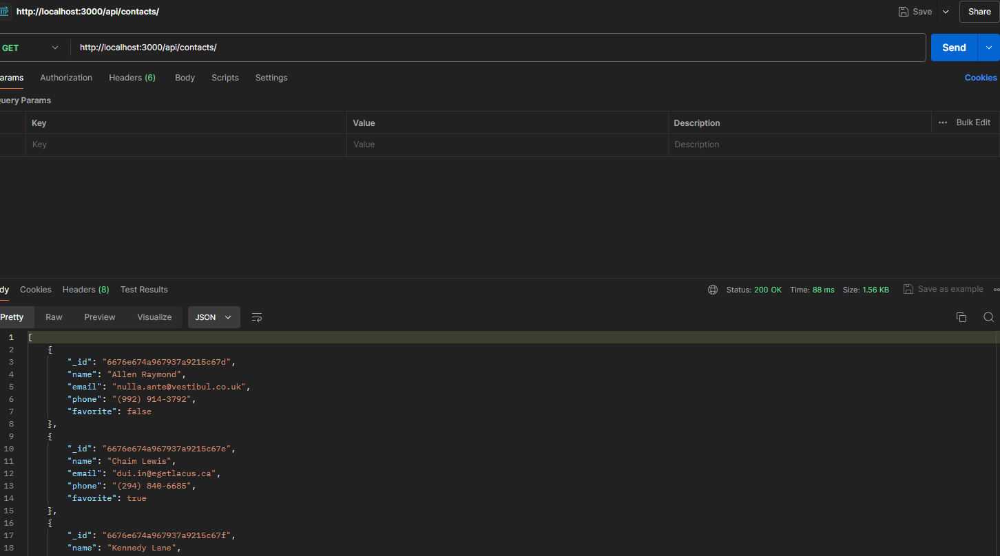
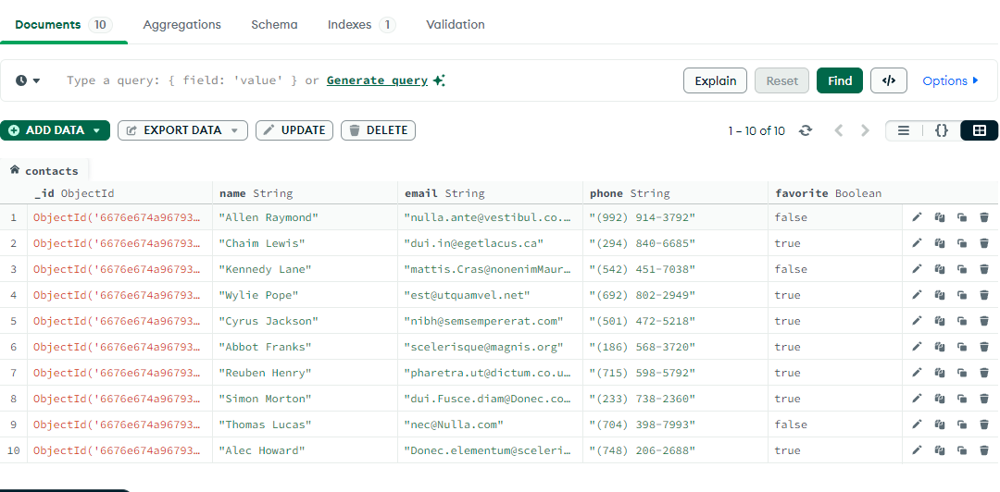

## Get contact by id

## Add the contact

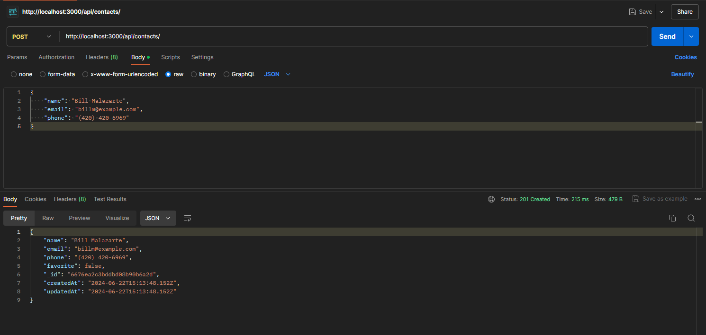
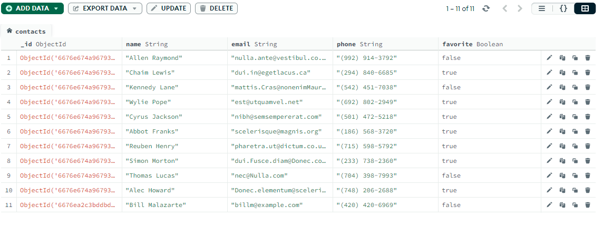

## Delete the contact

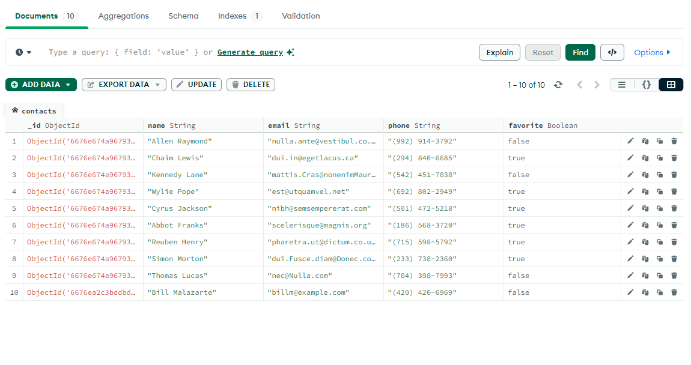

## Updated the contact

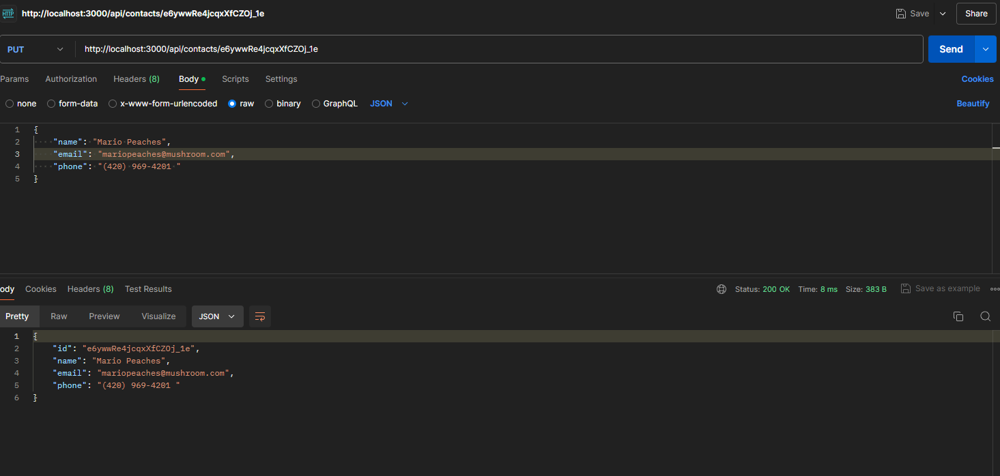
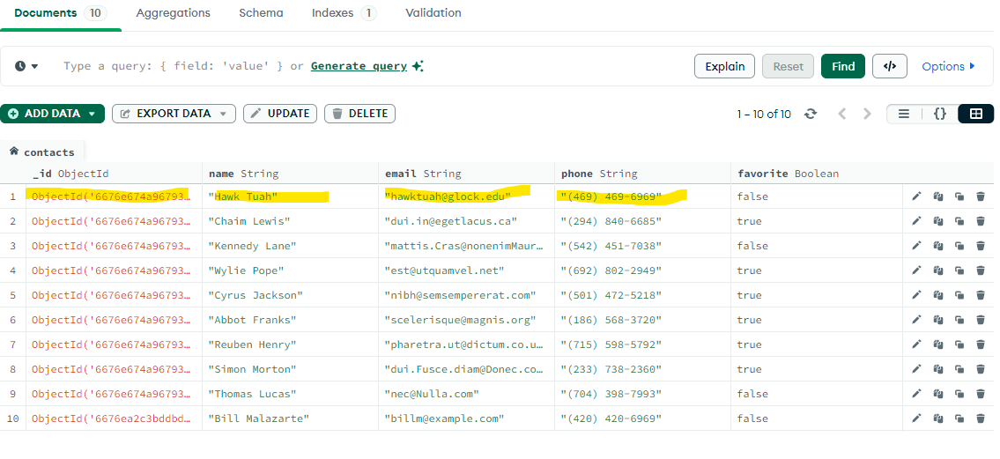

## Updated the favorite

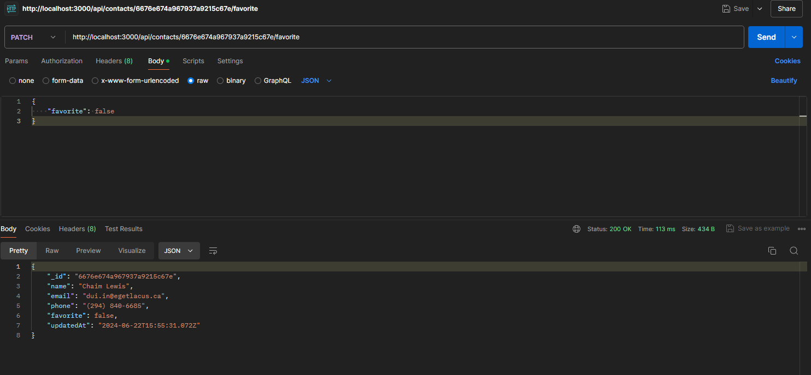
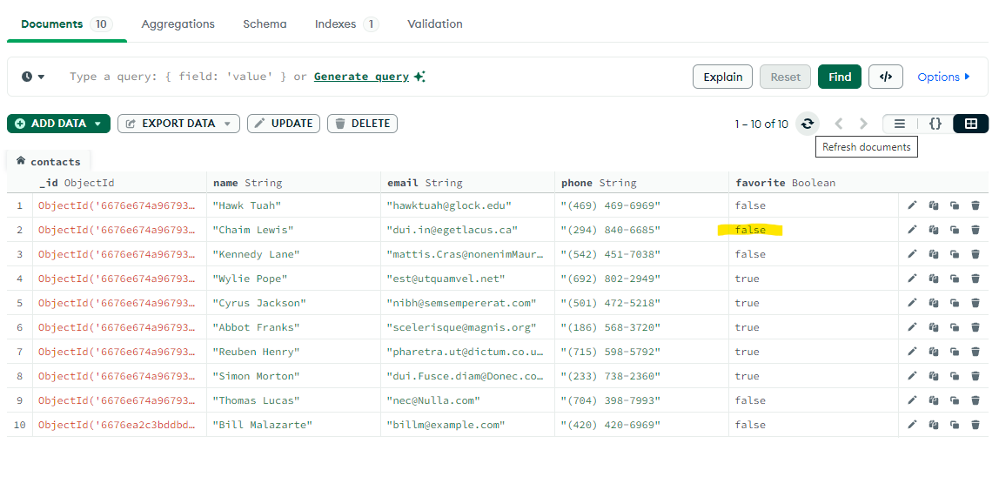

## Post User Sign up

## Post User Login

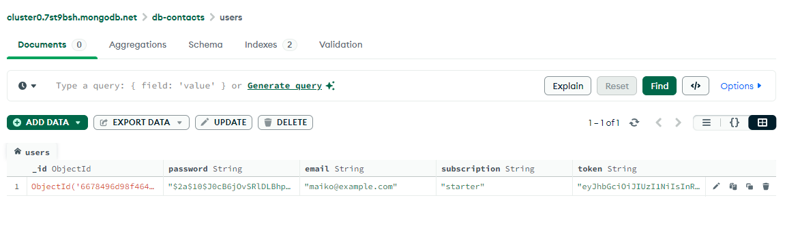

## Get User Logout

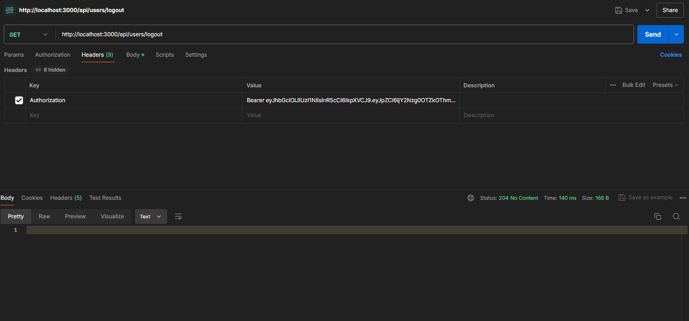

## Get User Current

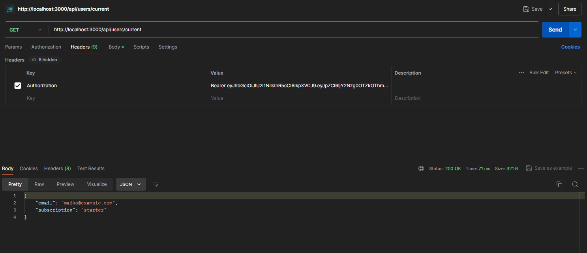

## Pagination

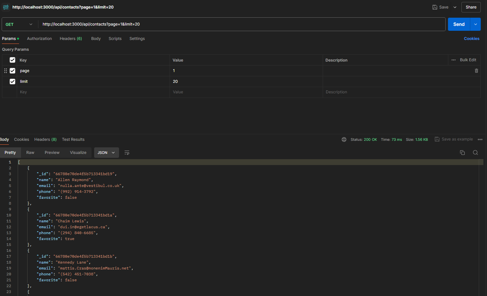
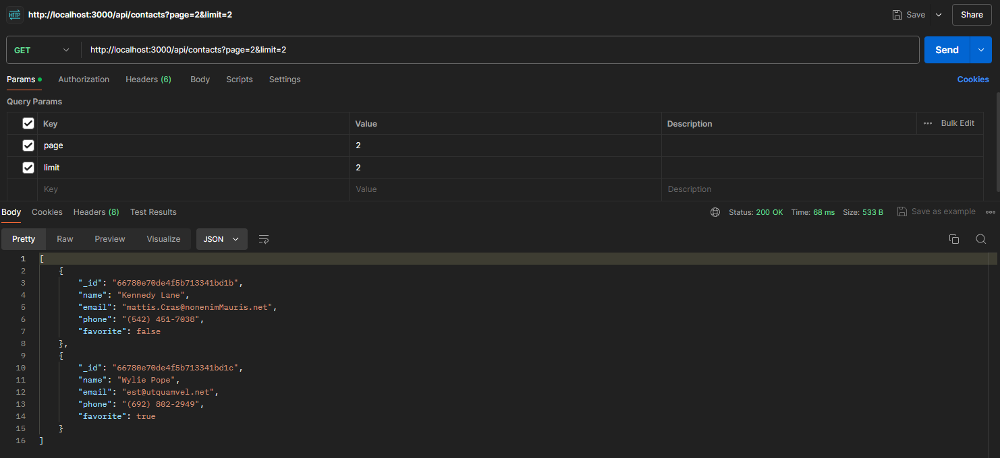

## Pagination Favorites list "true"

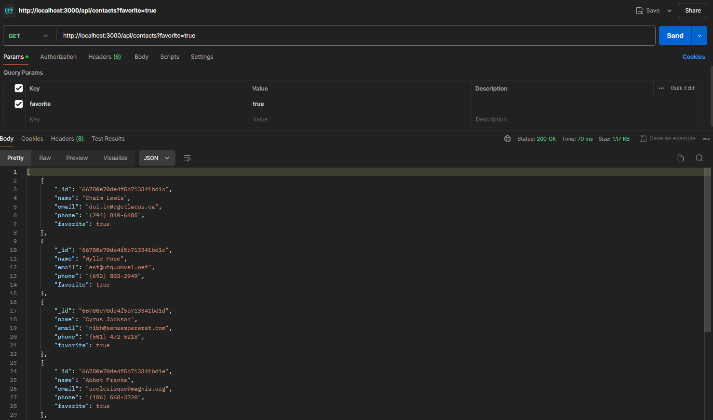

## Update Subcription Status

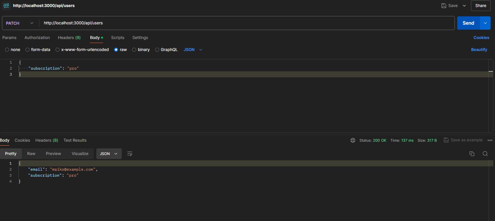
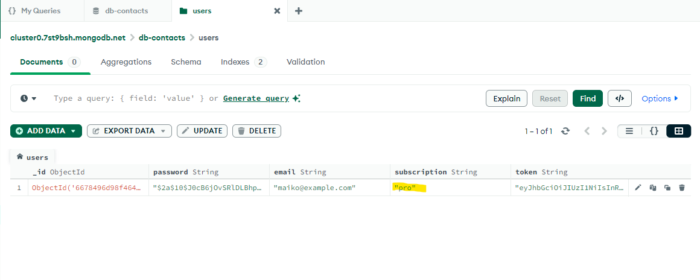

